# Building an EVPN/VXLAN Datacenter Fabric from Scratch with Linux and FRRouting

Traditional datacenter networking has a ceiling. VLANs cap at 4,094 segments. Spanning Tree blocks redundant links. Flood-and-learn burns bandwidth at scale. If you have worked with any of these constraints in production, you already know the pain.

EVPN/VXLAN is what replaced all of that. It is the fabric technology running inside every major cloud provider and modern datacenter today, from VMware NSX to Cisco ACI to OpenStack Neutron. But most engineers interact with it through vendor GUIs and abstraction layers, never seeing what actually happens at the protocol level.

This post walks through building a complete EVPN/VXLAN Spine-Leaf fabric from scratch, using nothing but Linux nodes, FRRouting, and GNS3. No vendor appliances, no black boxes. Just protocols, packets, and Wireshark captures to prove it all works.

## Why EVPN/VXLAN Over Traditional VLAN/STP

Before getting into the build, it helps to understand why this architecture exists.

A classic datacenter network relies on VLANs for segmentation and STP for loop prevention. That design has three fundamental problems at scale:

- **Segment limit**: VLAN IDs are 12 bits. That gives you 4,094 usable segments. In a multi-tenant datacenter, that runs out fast.
- **STP link waste**: Spanning Tree prevents loops by blocking redundant links. You pay for bandwidth you cannot use.
- **Flood storms**: Unknown unicast and broadcast traffic floods the entire L2 domain. The bigger the domain, the worse the noise.

VXLAN (RFC 7348) solves the first problem by using a 24-bit VNI (VXLAN Network Identifier), giving you roughly 16 million virtual segments. It encapsulates L2 frames inside UDP packets, which means your overlay traffic rides on a standard L3 routed underlay. No STP needed. All links carry traffic via ECMP.

EVPN (RFC 7432) solves the third problem by replacing flood-and-learn with a proper control plane. VTEPs advertise their local MAC/IP bindings proactively via BGP, so remote VTEPs know exactly where to send traffic before the first data packet ever crosses the wire.

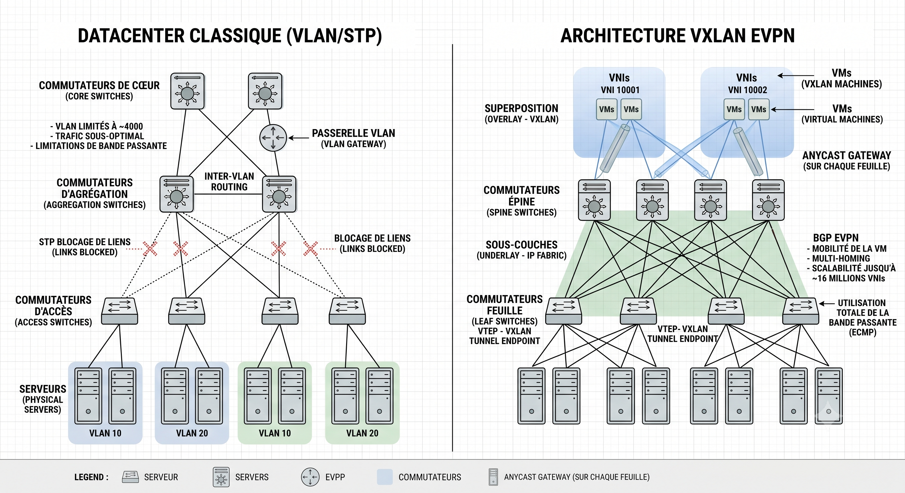

## The Architecture: Underlay and Overlay

The design separates concerns into two layers:

**Underlay**: A pure L3 IP network running OSPF. Its only job is to provide reachability between VTEP loopback addresses. It has no knowledge of virtual segments, tenant traffic, or MAC addresses.

**Overlay**: Virtual L2 segments stretched across the underlay via VXLAN tunnels. From the perspective of a VM sitting inside the overlay, it sees a flat Ethernet network. It has no awareness of the IP fabric underneath.

Think of it this way: the underlay is the highway system. The overlay is a private courier service that uses those highways to deliver its packages (L2 frames), with its own internal addressing that the highway infrastructure never needs to understand.

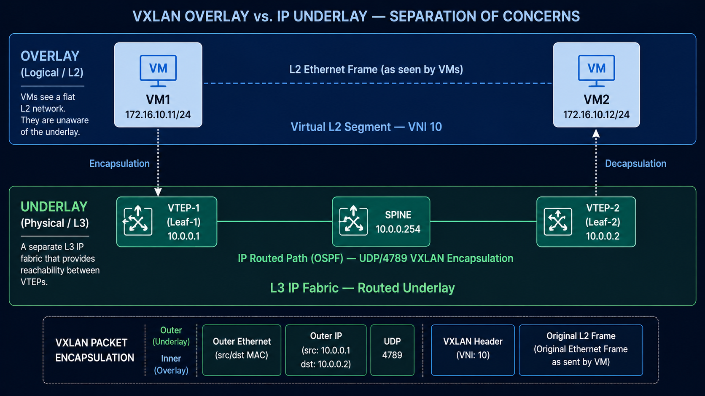


## Lab Topology

The lab runs a Spine-Leaf topology in GNS3 with Linux nodes:

- **1 Spine**: Acts as the BGP Route Reflector. It participates only in the control plane, never touches VXLAN data traffic.
- **2+ Leaves**: Linux nodes configured as VTEPs. Each one hosts endpoints (simulated via network namespaces) and runs both the VXLAN data plane and the BGP EVPN control plane.


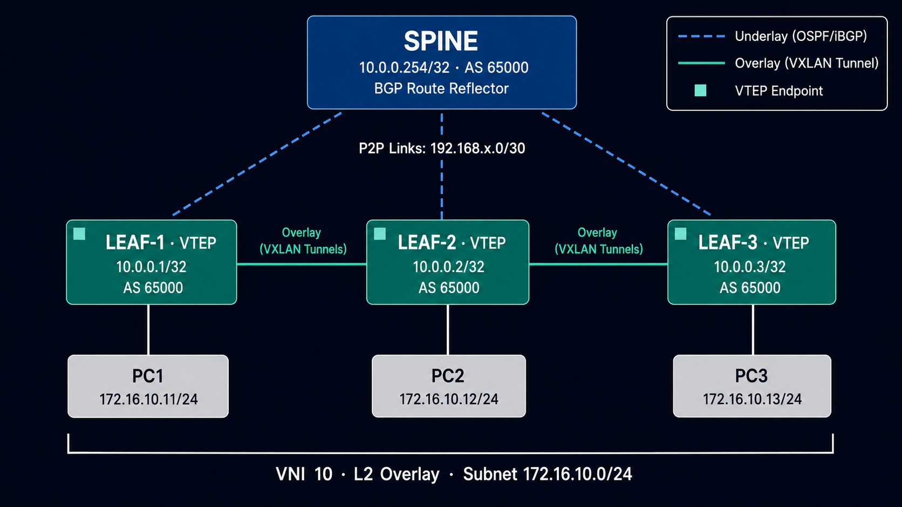

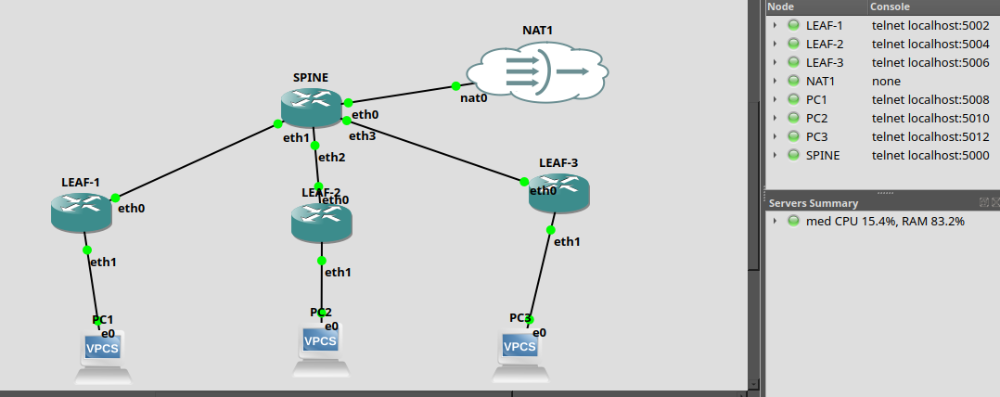

## Setting Up the Underlay

The underlay needs to accomplish one thing: every VTEP loopback must be reachable from every other VTEP loopback. OSPF handles that.

On each Leaf node, assign the physical interface and the loopback:

```bash
# Leaf-1: physical interface toward the Spine
ip addr add 192.168.1.2/30 dev eth0
ip link set eth0 up

# Loopback (this is the VTEP address)
ip addr add 10.0.0.1/32 dev lo
```

Then configure OSPF in FRRouting (`/etc/frr/frr.conf`):

```
router ospf
  ospf router-id 10.0.0.1
  network 192.168.1.0/30 area 0
  network 10.0.0.1/32 area 0
  passive-interface lo
```

Before touching anything else, verify the underlay is converged:

```bash
ping 10.0.0.2     # Other Leaf loopback
ping 10.0.0.254   # Spine loopback
```

If these pings fail, nothing else will work. The entire overlay depends on underlay IP reachability between VTEPs.

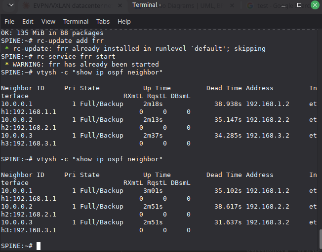

## Configuring the VXLAN Data Plane

With the underlay converged, each Leaf needs three things: a Linux bridge, a VXLAN interface, and an endpoint.

```bash
# 1. Create the bridge
ip link add br10 type bridge && ip link set br10 up

# 2. Create the VXLAN interface (VNI 10, VXLAN port 4789)
ip link add vxlan10 type vxlan id 10 dstport 4789 \
    local 10.0.0.1 nolearning
ip link set vxlan10 up

# 3. Attach VXLAN to the bridge
ip link set vxlan10 master br10

# 4. Create a simulated endpoint (network namespace)
ip netns add vm1
ip link add veth0 type veth peer name veth1
ip link set veth1 netns vm1
ip link set veth0 master br10 && ip link set veth0 up
ip netns exec vm1 ip addr add 172.16.10.11/24 dev veth1
ip netns exec vm1 ip link set veth1 up
```

The critical flag here is `nolearning`. It tells the VXLAN interface not to do data-plane MAC learning. That responsibility gets delegated entirely to the EVPN control plane, which is the whole point.

## The Control Plane: BGP EVPN with FRRouting

This is where the architecture comes together. FRRouting runs BGP with the L2VPN EVPN address family, distributing MAC/IP reachability information between VTEPs.

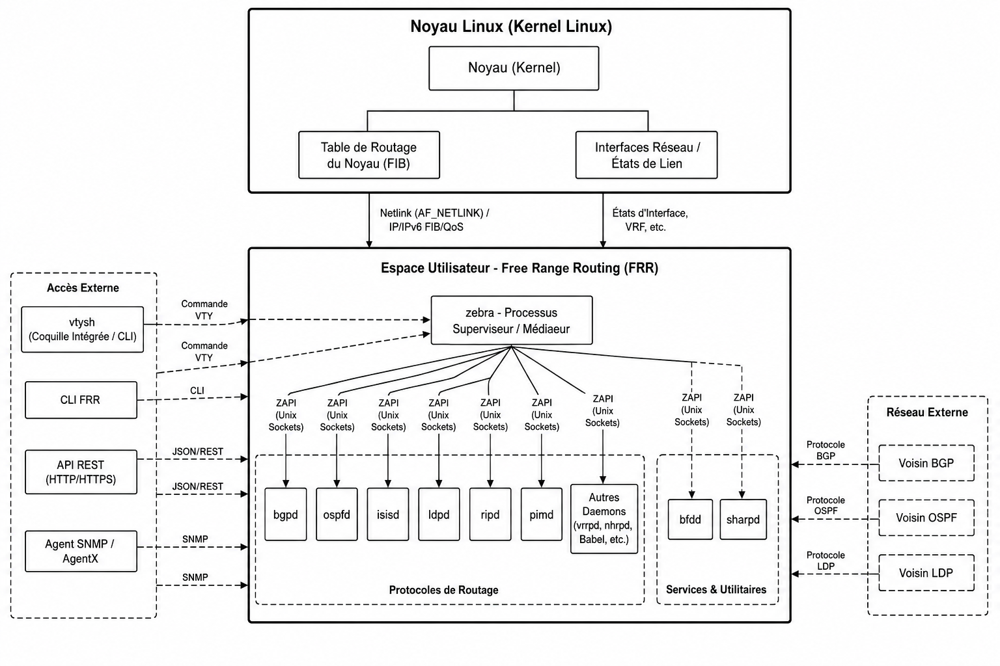

### Spine Configuration (Route Reflector)

The Spine does not run VXLAN. It only reflects BGP EVPN routes between the Leaves:

```
router bgp 65000
  bgp router-id 10.0.0.254
  neighbor LEAVES peer-group
  neighbor LEAVES remote-as 65000
  neighbor LEAVES update-source lo
  neighbor 10.0.0.1 peer-group LEAVES
  neighbor 10.0.0.2 peer-group LEAVES
  !
  address-family l2vpn evpn
    neighbor LEAVES activate
    neighbor LEAVES route-reflector-client
  exit-address-family
```

Without a Route Reflector, you would need a full-mesh of iBGP sessions between all VTEPs. That is N×(N-1)/2 sessions. The RR collapses that to N sessions.

### Leaf Configuration (VTEP)

Each Leaf peers with the Spine and advertises all locally discovered VNIs:

```
router bgp 65000
  bgp router-id 10.0.0.1
  neighbor 10.0.0.254 remote-as 65000
  neighbor 10.0.0.254 update-source lo
  !
  address-family l2vpn evpn
    neighbor 10.0.0.254 activate
    advertise-all-vni
  exit-address-family
```

The `advertise-all-vni` directive is what triggers automatic discovery. FRRouting scans the Linux kernel for all VXLAN interfaces, reads their VNIs, and generates the corresponding EVPN routes without any manual mapping.

### What Happens at Convergence

Once BGP sessions establish, the following sequence plays out:

1. Each Leaf sends a **Type 3 IMET route** (Inclusive Multicast Ethernet Tag) announcing its participation in VNI 10.
2. Each Leaf sends **Type 2 MAC/IP routes** for every locally learned endpoint.
3. The Spine reflects all routes to all peers.
4. On receiving a remote Type 2 route, FRR's `zebra` daemon calls the Linux kernel via Netlink to insert a static FDB entry on the local `vxlan10` interface, pointing the remote MAC to the remote VTEP's IP.

The result: every VTEP knows every endpoint's location before any data traffic is exchanged. No flooding required.

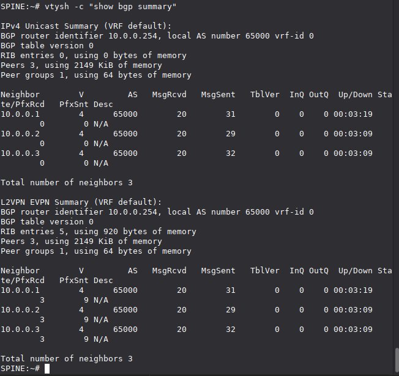

## Verifying the Fabric

### EVPN Route Table

Check the full EVPN route table on the Spine:

```bash
vtysh -c "show bgp l2vpn evpn"
```

You should see Type 2 (MAC/IP) and Type 3 (IMET) routes from every Leaf, each with its VTEP loopback as the next-hop and the Route Target (RT) identifying VNI 10.

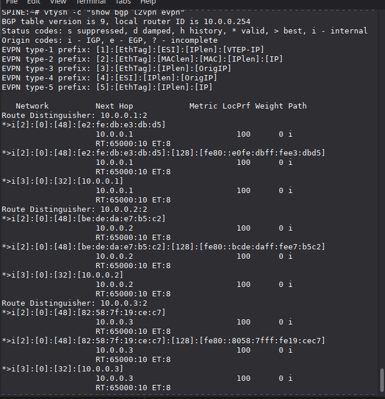

### Type 2 Routes (MAC/IP)

Filter specifically for MAC/IP advertisements:

```bash
vtysh -c "show bgp l2vpn evpn route type macip"
```

Each entry shows a MAC address, optionally with an associated IP, the originating VTEP, and the Route Distinguisher. These are the entries that get programmed into remote FDB tables.

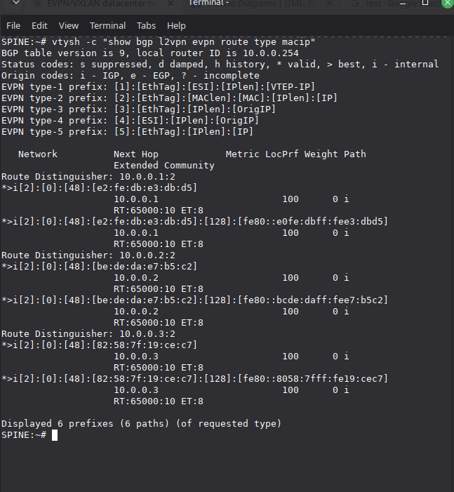

### Type 3 Routes (IMET/Multicast)

```bash
vtysh -c "show bgp l2vpn evpn route type multicast"
```

These define the BUM (Broadcast, Unknown unicast, Multicast) flood list. Only VTEPs that have announced a Type 3 route for a given VNI receive BUM traffic for that VNI.

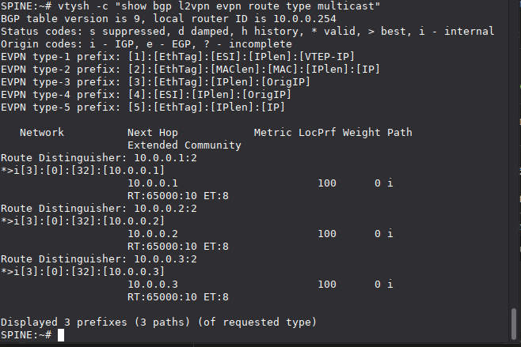

### FDB Entries

On a Leaf, inspect the bridge FDB to confirm that EVPN has populated remote MAC entries:

```bash
bridge fdb show dev vxlan10
```

You should see entries with `extern_learn` flag pointing remote MACs to remote VTEP IPs. These were not learned from data traffic. They were injected by FRR via Netlink based on received EVPN Type 2 routes.

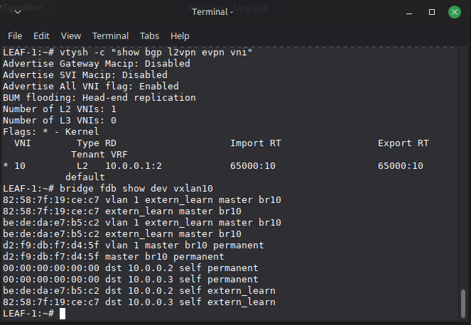

### Connectivity Test

The ultimate validation is a simple ping across the fabric:

```bash
ip netns exec vm1 ping -c 4 172.16.10.12
```

Zero packet loss confirms the full stack is working: OSPF underlay reachability, VXLAN encapsulation/decapsulation on UDP/4789, and EVPN control plane distributing the correct forwarding state.

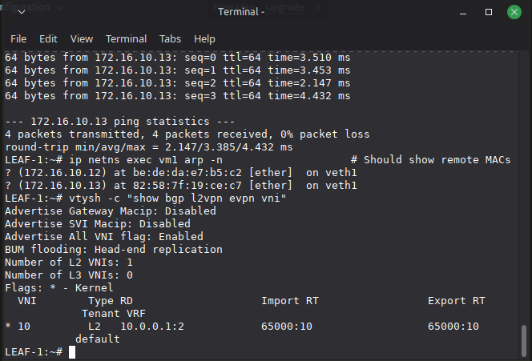

## How a Packet Actually Crosses the Fabric

Understanding the data path end-to-end is critical. Here is what happens when vm1 on Leaf-1 sends a frame to vm2 on Leaf-2:

1. The frame exits the namespace via `veth1` and arrives on bridge `br10`.
2. The bridge consults its FDB (populated by EVPN/FRR). It finds a match: the destination MAC is reachable via `vxlan10`, next-hop VTEP 10.0.0.2.
3. `vxlan10` encapsulates the original L2 frame: adds a VXLAN header (VNI 10), wraps it in UDP (destination port 4789), then in IP (source: 10.0.0.1, destination: 10.0.0.2).
4. The encapsulated packet is routed through the underlay via OSPF to Leaf-2.
5. Leaf-2's `vxlan10` interface decapsulates, strips the outer headers, and delivers the original L2 frame to its local `br10`, which forwards it to the destination namespace.

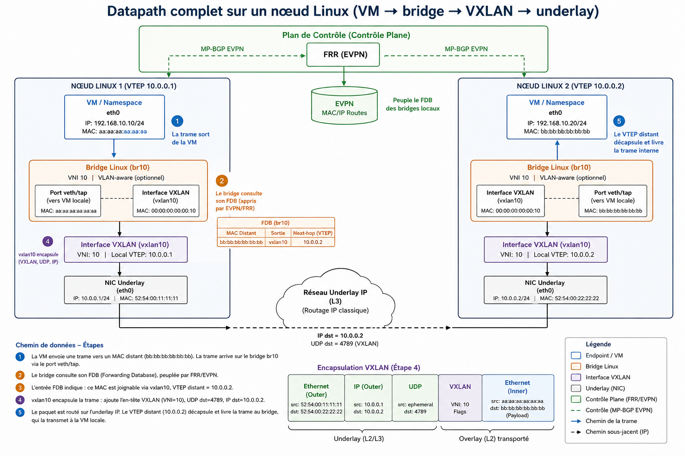

## The Difference: Flood-and-Learn vs EVPN

This comparison captures the fundamental shift:

**Flood-and-Learn (reactive)**: A VTEP receives a frame for an unknown MAC. It floods it to every other VTEP. The receiving VTEPs learn the source MAC from the data traffic itself. This generates enormous BUM traffic at scale.

**EVPN (proactive)**: Before any data packet is sent, VTEPs proactively advertise their local MACs via BGP Type 2 routes. Remote VTEPs pre-populate their FDB tables. When the first data packet arrives, the destination is already known. No flooding needed.

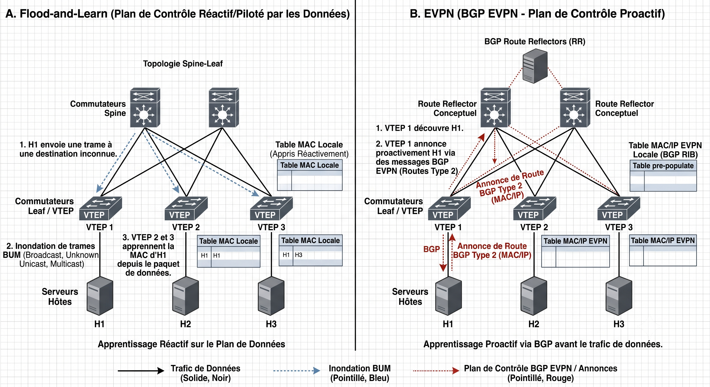

## EVPN Route Types

Two route types carry the core signaling:

**Type 2 (MAC/IP Advertisement)**: "MAC X with IP Y is behind me, on VNI Z." This is what populates the FDB on remote VTEPs with unicast forwarding entries.

**Type 3 (IMET - Inclusive Multicast Ethernet Tag)**: "I exist as a participant in VNI Z, send me BUM traffic for that segment." This builds the per-VNI flood list.

There are additional types (Type 1 for multi-homing, Type 5 for IP prefix routes in L3 VPN scenarios), but Type 2 and Type 3 are what make the basic L2 overlay function.

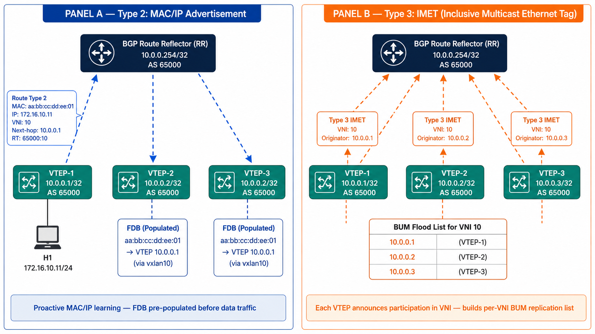

*Note: In the diagram above, VTEP-3 is labeled 10.0.0.2/32 instead of 10.0.0.3/32.*


## Where This Gets Used in Production

This is not a lab exercise for its own sake. EVPN/VXLAN is the production standard for:

- **Multi-tenant isolation**: Each tenant gets dedicated VNIs. IP address ranges can overlap across tenants without conflict. EVPN distributes routes only to authorized VTEPs.
- **Live VM migration**: When a VM migrates between hypervisors, the new VTEP generates a fresh Type 2 route. Remote FDB tables update within milliseconds via BGP. The VM keeps its MAC and IP. Zero network reconfiguration.
- **STP replacement**: The routed underlay eliminates L2 loops by design. All links carry traffic. ECMP distributes load.
- **Distributed anycast gateway**: The same gateway IP and MAC are configured on every Leaf. VMs always route through a local gateway, avoiding traffic tromboning to a centralized router.

## Security Considerations

From an infrastructure security perspective, VXLAN has a significant gap: it provides no native authentication or encryption. An attacker with access to the underlay network can inject arbitrary frames into the overlay by crafting VXLAN-encapsulated packets with a valid VNI. Similarly, the BGP EVPN control plane is susceptible to route poisoning if BGP sessions are not properly secured with MD5 authentication or TCP-AO.

In production deployments, this is typically addressed through:
- IPsec or MACsec on the underlay
- BGP session authentication
- Microsegmentation policies enforced at the hypervisor or Leaf level
- Strict ACLs on management plane access

These attack vectors represent an active area of research in datacenter security.

## Stack and References

**Tools used**: FRRouting, GNS3, Linux iproute2, Wireshark, BGP/OSPF

**Key RFCs**:
- RFC 7348: VXLAN
- RFC 7432: BGP MPLS-Based Ethernet VPN (EVPN)
- RFC 8365: A Network Virtualization Overlay Solution Using EVPN

**Further reading**:
- Dinesh Dutt, *Cloud Native Data Center Networking*, O'Reilly Media, 2019
- Cisco VXLAN BGP EVPN Design and Deployment Guide (Cisco Validated Design)
- [FRRouting Documentation](https://docs.frrouting.org/)

**Source code**: The full project (configs, scripts, GNS3 topology, and diagrams) is available on GitHub: [mrmeddah/evpn-vxlan-datacenter-fabric](https://github.com/mrmeddah/evpn-vxlan-datacenter-fabric)
