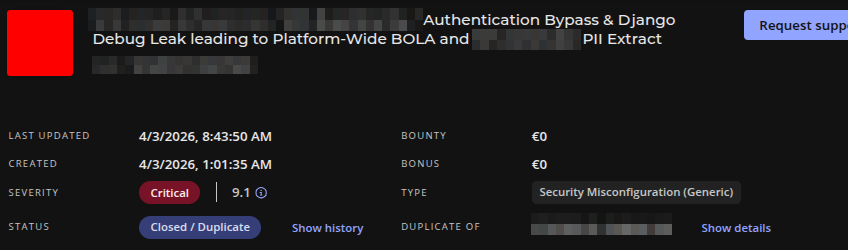
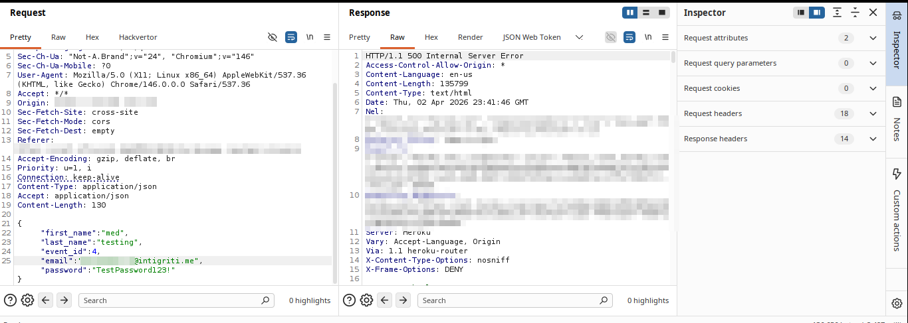
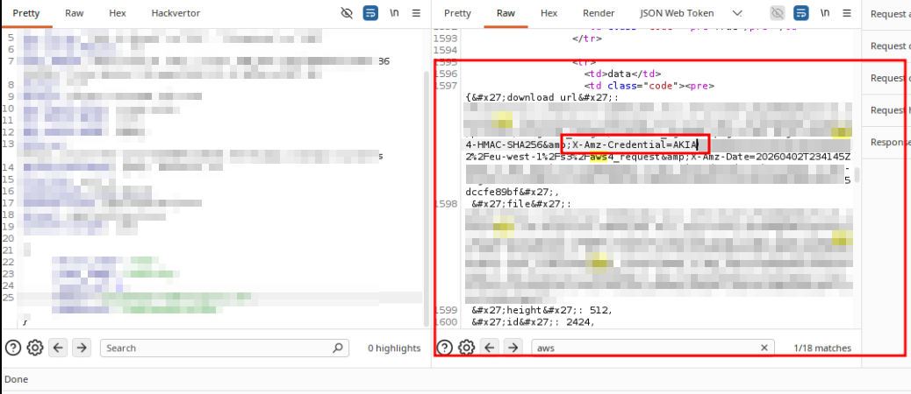
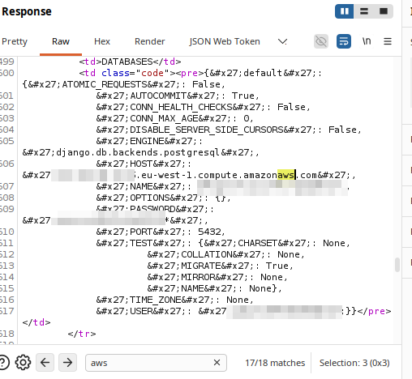
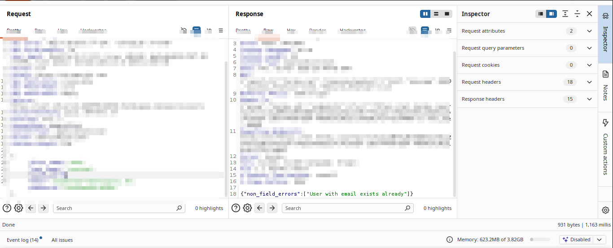
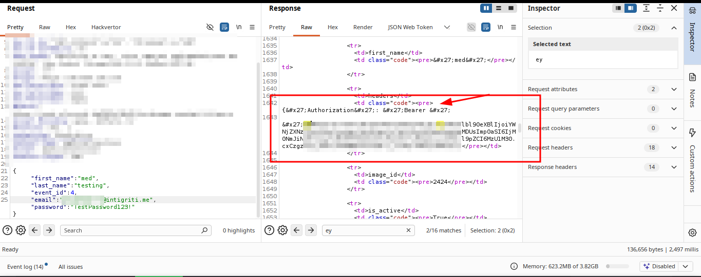
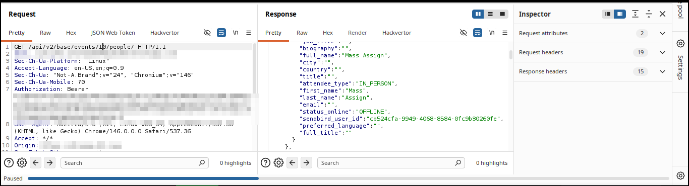
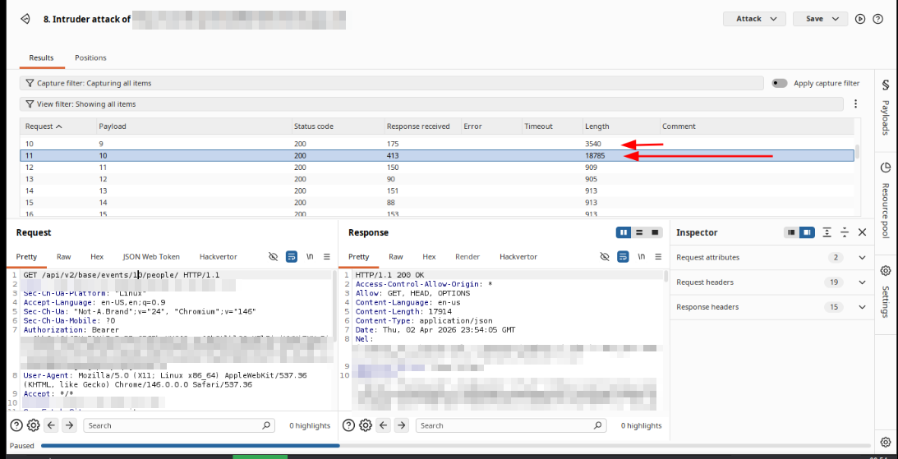

# When a Signup Form Hands You the Keys to the Kingdom

Most security researchers go after the obvious stuff. Login pages, password resets, file uploads. The classics. I get it, they work. But sometimes the most interesting attack surface is the thing sitting right next to what everyone else is looking at.

This is a story about a signup endpoint, a Django misconfiguration, and a chain that went from zero authentication to full platform PII extraction. It was also a duplicate. But we'll get to that.



---

## Reconnaissance: There Has to Be a Signup

The target was a live streaming platform used by corporate event organizers. When I first landed on `stream.[REDACTED].com`, the only visible auth surface was the login page. Clean, minimal, nothing obviously broken.

But a login page without a signup endpoint is like a hotel with no check-in desk. Someone has to get in somehow. The platform had active users and active events, which meant registration existed somewhere, even if the frontend didn't advertise it.

A bit of probing and the pattern revealed itself: `/api/v2/auth/user/signup/`. Nothing fancy, just API convention and intuition. It accepted a POST with the usual fields plus an `event_id` parameter, which immediately stood out. That parameter ties a user registration to a specific event context on the backend. And event-scoped signup logic tends to have edge cases.

## The Trigger: What Happens With a Bad Event ID?

The interesting question was never "does this work with a valid event ID?" The interesting question was "what does this break with an invalid one?"

I sent a signup request targeting `event_id: 4`, an event that turned out to have no configured email template. The user was created successfully (first problem), but then the backend tried to send a welcome email, hit an `UnboundLocalError` on an unconfigured `subject` variable, and crashed.

Here is where things got interesting.

The server returned a 500. But not just any 500. A full Django debug traceback. In production.

```
POST /api/v2/auth/user/signup/ HTTP/1.1
Host: cust-[REDACTED]-prod-[REDACTED].herokuapp.com
Content-Type: application/json

{
  "first_name": "test",
  "last_name": "testing",
  "event_id": 4,
  "email": "attacker@example.com",
  "password": "TestPassword123!"
}
```

Response: an enormous HTML page with Django's full internal error view, rendered and returned to an unauthenticated attacker.

I sat with it for a moment. You see a 500, your first instinct is "okay, crash, move on." But when it is Django debug mode in production, that HTML is not just an error message. It is a confession.

## The Loot Inside the Traceback

I started reading the debug page carefully instead of just noting the crash. Two sections stood out immediately.

The **Settings block** exposed the full application configuration as Django had loaded it into memory:

- `AWS_ACCESS_KEY_ID` and `AWS_SECRET_ACCESS_KEY`, production IAM credentials
- `AWS_STORAGE_BUCKET_NAME` pointing to a live S3 bucket
- `DATABASES` containing the PostgreSQL connection string including hostname, port, username, and password for a live EC2-hosted database



These were sitting in plaintext in the response body of a request that required zero authentication.

Then in the **Local vars table**, deeper in the traceback under the `save` function in the email handler, I found `user_token`. A JWT. Assigned to the user account that was just created during the request that crashed.



So the endpoint had committed the user to the database before failing. And the failure had leaked the session token in the error output. The user existed, was authenticated, and I had their token, all without ever completing registration or verifying an email address.

At this point the question shifted from "what did I find?" to "what can I do with it?"

## BOLA: The Logical Next Step

Having a valid JWT for a freshly created account is useful. What makes it dangerous depends entirely on how well the backend enforces authorization.

The platform had event management endpoints. The natural test was: can this account, registered under `event_id: 4`, access data from a completely different event?

```
GET /api/v2/base/events/22/people/ HTTP/1.1
Host: cust-[REDACTED]-prod-[REDACTED].herokuapp.com
Authorization: Bearer [EXTRACTED_JWT]
```

Response: `200 OK`.


Not a 403. Not a redirect. A full JSON array of every attendee registered to Event 22, including their full names, avatars, roles, internal Sendbird chat user IDs, and attendance type. The backend accepted the token, identified the user, and returned the data without ever asking whether that user had any business seeing it.

The object-level authorization check was simply not there.

Iterating through event IDs from there was trivial. Every event on the platform was accessible the same way.


## The Chain, End to End

What started as "there must be a signup endpoint somewhere" became:

1. Unauthenticated user creation via a signup endpoint that commits before validating
2. Forced server crash by targeting a misconfigured event ID
3. Django debug mode leaking production AWS credentials, database credentials, and a live JWT
4. BOLA on the events API allowing full attendee PII extraction across all events on the platform

Each step was a consequence of the previous one. None of them in isolation is the full story. The real finding was the chain.

## Outcome

Submitted as Critical. Triaged as a duplicate of a report that had come in before mine. The severity was confirmed at 9.1 CVSS, which tells you the other researcher found the same thing and the platform already knew it was bad.

Duplicate hurts. But a confirmed Critical 9.1 duplicate means I found a real critical vulnerability independently. The methodology was right. The timing just wasn't.

The debug mode has since been disabled and the vulnerable endpoint patched.